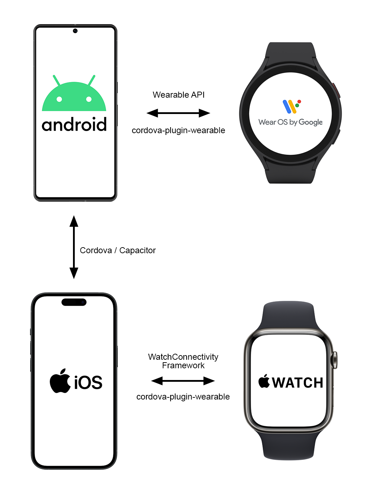
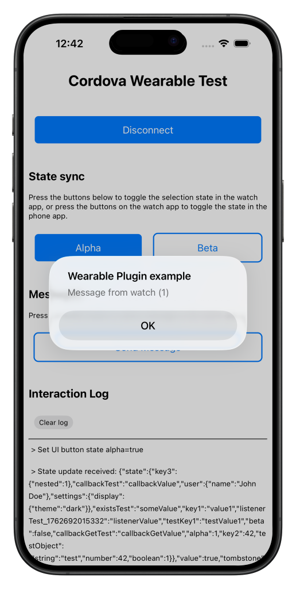
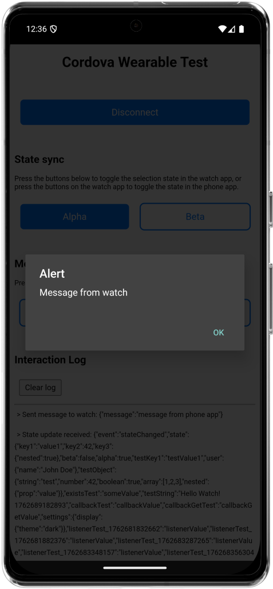
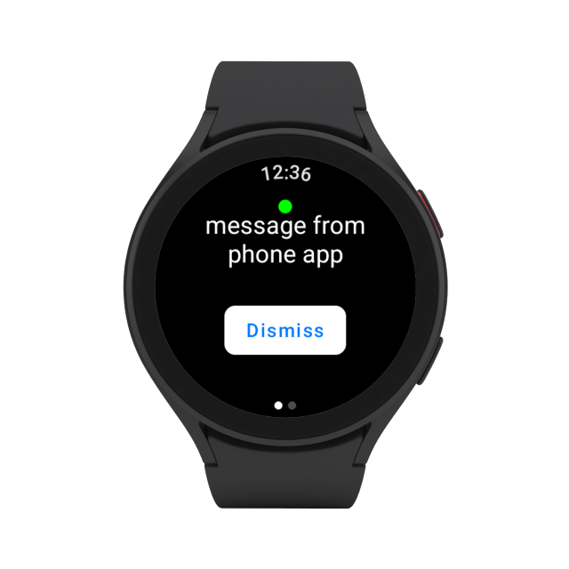
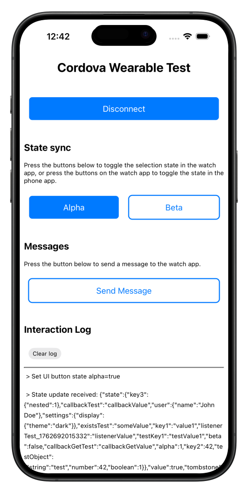
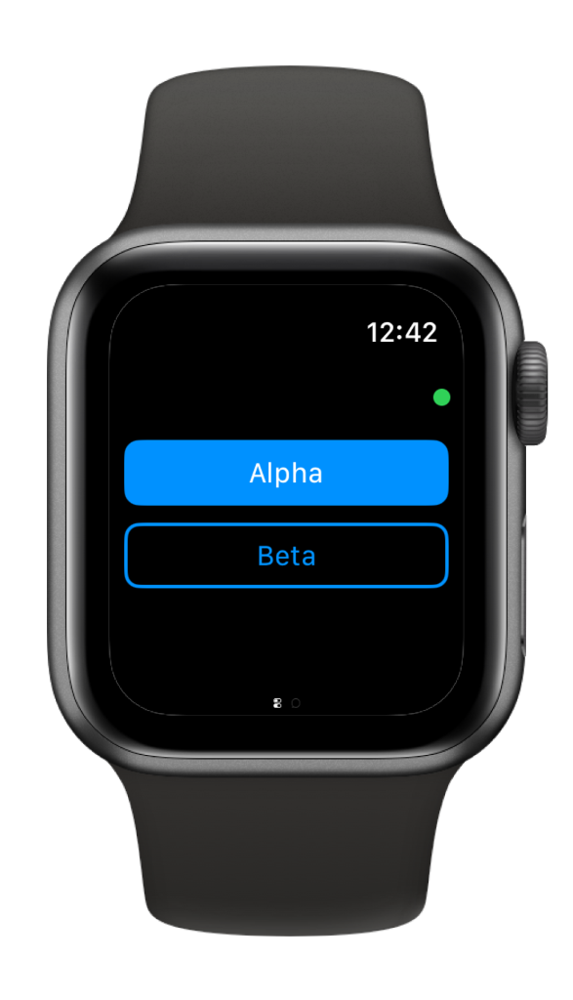
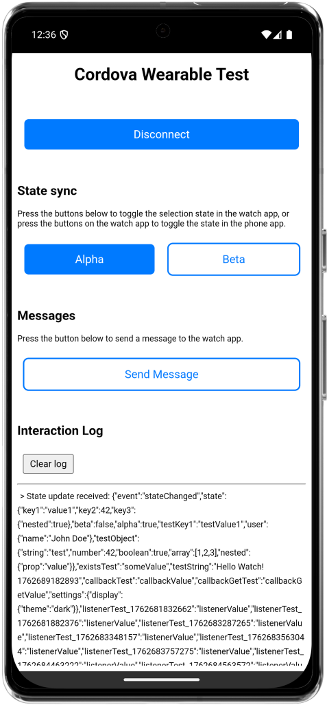
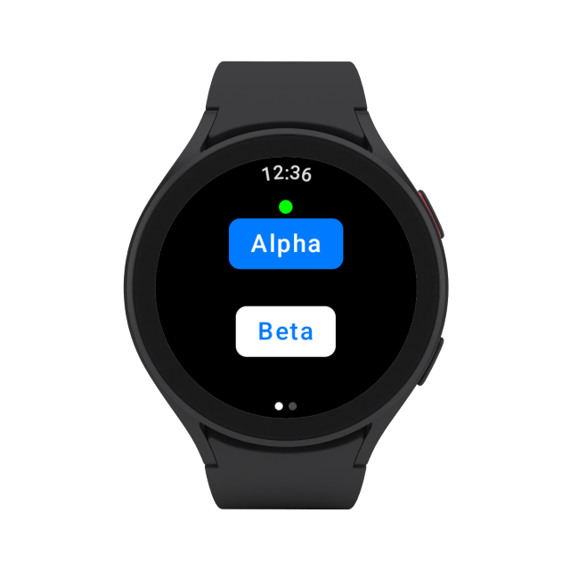
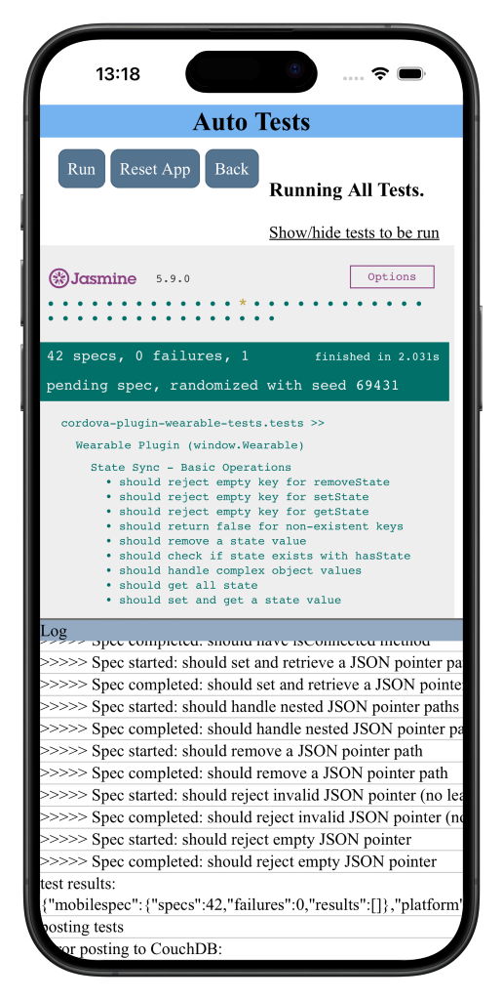
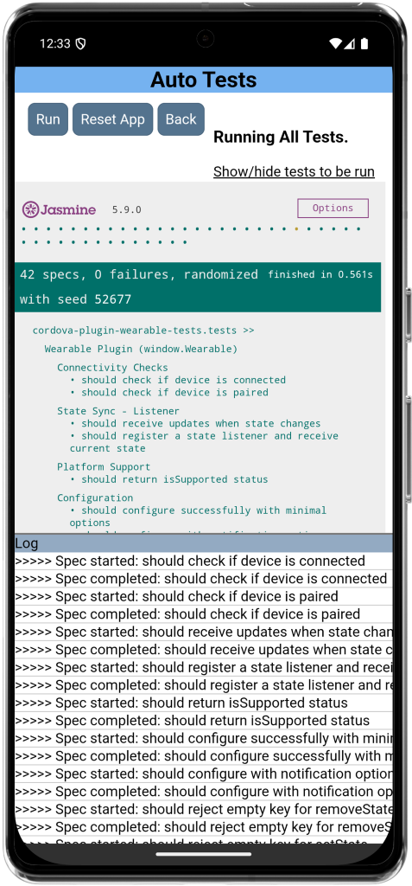

cordova-plugin-wearable
=======================

A Cordova/Capacitor plugin that provides a cross-platform JavaScript API for Android & iOS mobile apps to communicate with their companion watch apps on their respective wearable platform (Wear OS and watchOS).

It is currently the only plugin that offers a unified plugin API for both iOS/watchOS & Android/Wear OS platforms.



<!-- START doctoc generated TOC please keep comment here to allow auto update -->
<!-- DON'T EDIT THIS SECTION, INSTEAD RE-RUN doctoc TO UPDATE -->
**Table of Contents**

- [Overview](#overview)
- [Highlights](#highlights)
- [Quickstart & Resources](#quickstart--resources)
- [Install the plugin](#install-the-plugin)
  - [Cordova](#cordova)
  - [Capacitor](#capacitor)
    - [Web / JS integration (Capacitor)](#web--js-integration-capacitor)
    - [Android (Capacitor Android project)](#android-capacitor-android-project)
    - [iOS (Capacitor iOS project)](#ios-capacitor-ios-project)
    - [Plugin configuration and version variables](#plugin-configuration-and-version-variables)
    - [Capacitor Notes and troubleshooting](#capacitor-notes-and-troubleshooting)
- [Cross-platform usage](#cross-platform-usage)
  - [Configure the plugin](#configure-the-plugin)
  - [Plugin events](#plugin-events)
  - [API semantics](#api-semantics)
  - [Check support, pairing, and connection](#check-support-pairing-and-connection)
  - [Register a message listener](#register-a-message-listener)
  - [Send data to watch](#send-data-to-watch)
  - [Shared state sync](#shared-state-sync)
    - [JavaScript API](#javascript-api)
      - [Cross-platform data contract](#cross-platform-data-contract)
- [Project Structure](#project-structure)
  - [Plugin Source](#plugin-source)
  - [Example project](#example-project)
- [Testing](#testing)
  - [Prerequisites](#prerequisites)
  - [Installing Test Dependencies](#installing-test-dependencies)
  - [Running Automated Tests](#running-automated-tests)
    - [Running Tasks](#running-tasks)
  - [Test Coverage](#test-coverage)
  - [Requirements and important notes](#requirements-and-important-notes)
  - [Debugging tips & quick checks](#debugging-tips--quick-checks)
    - [Development workflow](#development-workflow)
- [iOS/watchOS implementation](#ioswatchos-implementation)
  - [Why watchOS apps must be embedded in the same Xcode project](#why-watchos-apps-must-be-embedded-in-the-same-xcode-project)
  - [How the watchOS embedding works](#how-the-watchos-embedding-works)
  - [Customizing the embedding for your own project](#customizing-the-embedding-for-your-own-project)
  - [Important notes for iOS/watchOS development](#important-notes-for-ioswatchos-development)
  - [Background Execution Limitations on iOS](#background-execution-limitations-on-ios)
- [Frequently Asked Questions (FAQ)](#frequently-asked-questions-faq)
  - [How does this plugin compare to existing Cordova wearable plugins?](#how-does-this-plugin-compare-to-existing-cordova-wearable-plugins)
  - [Can I use this plugin with existing watch apps?](#can-i-use-this-plugin-with-existing-watch-apps)
  - [Does this plugin support complications (watch face widgets)?](#does-this-plugin-support-complications-watch-face-widgets)
  - [What are the size/performance considerations?](#what-are-the-sizeperformance-considerations)
  - [How do I debug communication issues?](#how-do-i-debug-communication-issues)
- [License](#license)

<!-- END doctoc generated TOC please keep comment here to allow auto update -->


# Overview

- Provides two key mechanisms for phone<->watch communication:
 -  simple request/response and event-driven API for sending messages and data between a phone app and a watch app.
 -  optional "Shared State Sync" subsystem for keeping UI state in sync between phone and watch.
- Background-capable listeners on Android via a foreground service so messages can be received while the app is backgrounded.
- A consistent semantics surface across Android/Wear OS and iOS/watchOS implementations so developers can write one integration that works across platforms.

# Highlights

- **True cross-platform support**: The only Cordova/Capacitor plugin that targets both Android/Wear OS *and* iOS/watchOS with a unified JavaScript API. Write your integration code once and deploy to both platforms.

- **Bi-directional communication out-of-the-box**: Built-in support for sending and receiving messages in both directions—phone to watch and watch to phone—with a clean, Promise-based API.

|  |  
 |  

- **Shared State Synchronization**: Includes an optional per-path Last-Writer-Wins (LWW) CRDT state sync subsystem for effortless state replication between devices. Perfect for syncing UI state, preferences, and small data objects without manual message handling.

|  |  
 |  

- **Modern platform support**: Leverages current Google Play Services APIs (MessageClient, DataClient, CapabilityClient) and WatchConnectivity framework, ensuring compatibility with modern Wear OS and watchOS versions.

- **Active development and maintenance**: This plugin is under active development with ongoing improvements, bug fixes, and support for the latest platform features—unlike many abandoned wearable plugins.

- **Minimal platform modifications**: Unlike other wearable plugins that require extensive manual changes to Cordova's volatile platform projects (breaking the Cordova workflow), this plugin uses Cordova hooks and automation to handle platform integration with minimal developer intervention.

- **Tested and verified**: Comes with a comprehensive automated test suite using `cordova-paramedic` to ensure reliability across platforms and use cases.

|  |  

- **Developer-friendly**: Comprehensive documentation, working example apps for both phone and watch platforms, and detailed debugging guidance to help you build robust wearable experiences.

# Quickstart & Resources

- **Example apps**: Clone the sibling repo [`cordova-plugin-wearable-example/`](https://github.com/dpa99c/cordova-plugin-wearable-example) for working Cordova (`cordova-app/`), Capacitor (`capacitor-app/`), Wear OS (`wearos-app/`), and watchOS (`watchos-app/`) samples that mirror the plugin API and state sync flows.
- **Testing**: Run the automated suite with `cordova-paramedic` or the VS Code tasks declared in the example repo (`test-plugin-android`, `test-plugin-ios`, `test-plugin-both`). Manual scenarios live in the example Cordova app via `cdvtests/index.html` once the test plugins are installed.
- **Platform refresh commands**: When you touch native sources (`src/android`, `src/ios`) or watch companion projects, re-run the platform refresh steps documented in `.github/copilot-instructions.md` to keep generated platform code in sync.
- **Contributing**: Review `CONTRIBUTING.md` for workflow, coding-style, and test expectations before opening a pull request.

# Install the plugin

## Cordova

```bash
cordova plugin add cordova-plugin-wearable
```

## Capacitor

```bash
npm install cordova-plugin-wearable
npx cap sync
```

**Manual steps**

When the plugin is installed into a Cordova project, it automatically applies necessary platform modifications. However, Capacitor does not support this automatic modification process. Therefore, when using Capacitor, you must manually apply the following steps after installing the plugin:

### Web / JS integration (Capacitor)

The plugin ships a small JS shim (`www/wearable.js`) that exposes the `Wearable` global expected by the API examples. Capacitor does not automatically copy this file into your native projects, so add it to your web assets and ensure it is loaded at runtime.

Options:

- Copy the file into your app's web assets and include it in `index.html`:

```bash
mkdir -p src/assets
cp node_modules/cordova-plugin-wearable/www/wearable.js src/assets/wearable.js
```

Then add to `index.html` (or import it in your bundler entry):

```html
<script src="/assets/wearable.js"></script>
```

- Or import it from your app code (if your bundler supports importing plain JS from node_modules):

```js
import Wearable from 'cordova-plugin-wearable'
```

After copying or importing the JS file, rebuild your web assets and run `npx cap copy` or `npx cap sync` so Capacitor updates platform projects.

### Android (Capacitor Android project)

You need to add the plugin's Kotlin sources, dependencies and manifest entries to the Android app module.

Summary of required changes (apply in `android/app` / your Android module):

- Add Gradle dependencies (module `build.gradle` `dependencies` block):

```gradle
implementation "com.google.android.gms:play-services-wearable:18.0.0"
implementation "com.google.android.gms:play-services-tasks:18.0.1"
implementation "androidx.work:work-runtime-ktx:2.8.1"
```

If your project defines these versions via variables, you can substitute them accordingly. These versions are the plugin defaults; bump if your project requires newer versions.

Then build the Android app as you normally would (Android Studio or `./gradlew assembleDebug`).

### iOS (Capacitor iOS project)
  
On iOS you must add the Swift source files to your Xcode app target and link the WatchConnectivity framework. The plugin Swift files are under `node_modules/cordova-plugin-wearable/src/ios/`.

Steps (Xcode):

1. Add the WatchConnectivity framework to your app target: in the project settings, under **General → Frameworks, Libraries, and Embedded Content** click `+` and add `WatchConnectivity.framework`.

2. If your app does not already use Swift, ensure the project is configured to embed Swift standard libraries (Xcode will normally prompt to create a Swift bridging header or set the flag automatically when adding Swift files). Set the Swift version to match your Xcode toolchain.

3. If your app uses a companion watchOS app, ensure the watch app target is present and embedded. The plugin expects the watch and phone app to share the same group/identifiers; follow the example project if you need guidance embedding the watch app into the iOS project.

4. Run a build in Xcode (`Product → Build`).

### Plugin configuration and version variables

The Cordova `plugin.xml` exposes two plugin preferences to override Play Services versions at install time:

- `PLAY_SERVICES_WEARABLE_VERSION` (default `18.0.0`)
- `PLAY_SERVICES_TASKS_VERSION` (default `18.0.1`)

If your Android project centralises Google Play Services versions (for example using `ext` variables or `gradle.properties`), align the dependency versions to avoid version conflicts. Adjust the `implementation` lines shown above accordingly.

### Capacitor Notes and troubleshooting

- If you see unresolved references to Kotlin/Android classes, verify the Kotlin plugin is applied and the Kotlin stdlib is available to the project.
- If message/capability discovery fails between phone and watch, confirm both apps use the same applicationId/package and are signed with the same signing key (see plugin README and example project notes). This is required for Google Play Services Data Layer deliveries.
- When making native changes you will usually need to rebuild the native project (clean + build) so Xcode/Gradle pick up the new sources.
- For watchOS embedding on iOS, follow the example app (the plugin repository includes an example watchOS target and an Xcode hook script in the example project). If you're unsure, inspect `cordova-plugin-wearable-example/cordova-app` for a working configuration.

# Cross-platform usage

The plugin exposes a consistent JavaScript API for both Android and iOS platforms:

## Configure the plugin

Before using the plugin, you must configure it:

```javascript
await Wearable.configure({
	// Android-only (required on Android, ignored on iOS):
	capability: 'my_capability',         // Capability advertised by your Wear OS watch app
	path: '/my/path',                    // Message path used for phone<->watch comms

	// Android-only (optional, ignored on iOS): customize the foreground service notification
	notificationTitle: 'My App',
	notificationText: 'Connected to your watch',

	// Cross-platform:
	enableLogging: true
});

// Note: iOS uses WatchConnectivity framework which has different semantics:
// - No capability/path configuration needed (WCSession manages pairing automatically)
// - No foreground service notification (iOS uses background transfers and applicationContext)

// Start and stop connectivity explicitly
await Wearable.startConnectivity();
// ... later ...
await Wearable.stopConnectivity();
```

## Plugin events

Register for plugin-generated events:

```javascript
await Wearable.registerEventListener(function (evt) {
	// evt.event is the event name
	// Platform-specific events:
	// Android: 'isPairedChanged', 'isConnectedChanged'
	// iOS: 'sessionWatchStateDidChange', 'sessionReachabilityDidChange', 
	//      'sessionDidBecomeInactive', 'sessionDidDeactivate'
	// evt.value contains event-specific data (e.g., boolean for paired/connected state)
});
```

## API semantics

The plugin provides a consistent API across platforms, but the underlying implementation details differ:

**isSupported()**
- Android: Performs a capability-client call to verify the Wearable API is available
- iOS: Returns `WCSession.isSupported()`

**isPaired()**
- Android: System-level pairing (any connected/paired node exists)
- iOS: Returns `WCSession.isPaired`

## Check support, pairing, and connection

The JS API supports both callback-style and Promise-style:

```javascript
// Promise / async example
(async function() {
  try {
	const sup = await Wearable.isSupported();
	console.log('isSupported ->', sup.isSupported);

	const paired = await Wearable.isPaired();
	console.log('isPaired ->', paired.isPaired);

	const connected = await Wearable.isConnected();
	console.log('isConnected ->', connected.isConnected);
  } catch (err) {
	console.error('Error checking wearable state', err);
  }
})();

// Callback-style (also supported)
// Wearable.isSupported(function(res){ ... }, function(err){ ... });
```

## Register a message listener

```javascript
// callback-style listener
Wearable.registerMessageListener(function(message) {
	if(message.key){
		console.log('Watch message', message.key);
	}else{
		console.log('Watch event', message);
	}
}, function(err) {
	console.error('Listener error', err);
});

// registerMessageListener also returns a Promise when called without callbacks:
// await Wearable.registerMessageListener();
```

## Send data to watch

```javascript
// Promise style
(async function(){
	try {
		await Wearable.sendMessageToWatch({ key: 'value' });
		console.log('Sent');
	} catch (err) {
		console.error('Send error', err);
	}
})();

// Callback-style still supported:
// Wearable.sendMessageToWatch({ key: 'value' }, cb, errCb);
```

## Shared state sync
This plugin includes an optional "Shared State Sync" subsystem that provides a small, per-path Last-Writer-Wins (LWW) replicated state store between the phone and watch device. It's intended for small UI-centric state (toggle buttons, small feature flags, simple JSON blobs) to keep the watch UI in sync with the phone app without manual message handling. 

Shared state is a durable, convergent data store synchronized between the phone app and watch device. It uses per-path Last-Writer-Wins (LWW) with tombstones and reliable delivery so edits made while offline converge on reconnect. 

Key concepts
- Path-based keys: Each state entry is addressed by a JSON Pointer path string (RFC 6901), for example: `/list/items/123/checked`.
- Values: Any JSON-serializable value. Deletions are represented as tombstones.
- Versioning: For each path, maintain a logical version v = { c, r } where c is a monotonic counter local to the replica for that path and r is a stable replicaId (UUID) for the app install. Ordering is lexicographic: higher (c, r) wins.
- Conflict resolution: LWW per-path using version ordering. Deletion is an operation type and participates in LWW; whichever op has the higher version determines the effective value or absence.
- Tombstones: Deletes set tombstone=true. Tombstones are garbage-collected after the peer acknowledges having seen the delete (“seen up to” acks).

Transport
- The plugin uses the configured `path` (e.g., `/data`). Shared state uses a subspace:
	- Base: `${configuredPath}/state`
	- Ops: `${configuredPath}/state/op/{opId}` (reliable per-op DataItem)
	- Snapshot: `${configuredPath}/state/snapshot` (current full state for bootstrap)
	- Ack: `${configuredPath}/state/ack` (batched acknowledgements)

Payload shapes (JSON)
- Operation (op): sent for every local mutation and replayed to peers when connected.
	```json
	{
		"type": "put" | "del",
		"path": "/json/pointer",
		"value": "any",               // present for type=put
		"version": { "c": 1, "r": "replica-uuid" },
		"opId": "uuid",
		"ts": 1690000000000         // optional, diagnostic
	}
	```
- Snapshot: full picture used for bootstrap/rejoin.
	```json
	{
		"fromReplica": "replica-uuid",
		"epoch": 1,                 // optional hint; new replicaId implies cold start
		"entries": [
			{ "path": "/a/b", "tombstone": false, "version": { "c": 3, "r": "..." }, "value": 123 },
			{ "path": "/x", "tombstone": true,  "version": { "c": 2, "r": "..." } }
		]
	}
	```
- Ack: confirms receipt so tombstones can be GC’d safely.
	```json
	{
		"fromReplica": "replica-uuid",
		"seen": [ { "path": "/x", "version": { "c": 2, "r": "..." } } ]
	}
	```

Replica identity & epochs
- replicaId: a stable UUID persisted per install (SharedPreferences on Android; UserDefaults on iOS in future).
- epoch: optional monotonic integer. Unknown replicaId implies a cold peer; send snapshot.

Merge rules (receiver)
1) For each incoming op or snapshot entry, compare incoming version v with local vL for that path.
2) If v > vL, apply the change: store value (tombstone=false) or delete (tombstone=true).
3) Persist and notify the JS listener only if the effective materialized state changed.
4) Enqueue an ack for { path, version } back to the sender (batch these).

Materialization
- Persist per-path entries keyed by their JSON Pointer. To compute the full state object for the JS listener, start from `{}` and apply each (path, value) with pointer semantics; skip tombstoned paths. Optionally cache materialized state and invalidate on changes.

Size and chunking
- Prefer small values per path. Keep individual DataItem payloads under ~100KB. For large snapshots, split the entries array across multiple snapshot chunks with indices; future work may add explicit chunk fields.

Multiple watches & re-installs
- The scheme works for N replicas. Tie-breaks on equal counters use replicaId ordering. If a device is re-installed (new replicaId), peers treat it as unknown and send a snapshot.

Security & privacy
- Do not place secrets in shared state. Treat payloads as application data synchronized between your paired apps.

### JavaScript API

- `registerStateListener(callback)`
	- Immediately invokes the callback with `{ event: 'stateChanged', state: <object> }` containing the current state.
	- Invokes on every effective change (local or remote) after merges.

- `unregisterStateListener()`
  - Stops delivering state change callbacks; safe to call when no listener is registered.

- `setState(key, value)` / `removeState(key)`
	- Operate on top-level keys (equivalent to JSON Pointers `/${key}`).

- `setStatePath(jsonPointer, value)` / `removeStatePath(jsonPointer)`
	- Per-path LWW updates using RFC 6901 JSON Pointers (e.g., `/list/items/123/checked`).

- `getState(key)` / `hasState(key)` / `getAllState()`
	- Query helpers; `getAllState()` returns the materialized object.

#### Cross-platform data contract

The shared-state query APIs resolve to the same payload shape on Android and iOS:

- `getState(key)` → `{ exists: boolean, value?: any }` (the `value` property is omitted when `exists === false`).
- `hasState(key)` → `{ has: boolean }`.
- `getAllState()` → plain JSON object with the materialized state; booleans remain booleans, numbers remain numbers, and `null` is preserved.
- `registerStateListener()` callbacks always receive `{ event: 'stateChanged', state: <object> }`.

All methods support both callbacks and Promises, consistent with the rest of the plugin.

Quick example
- Phone (JS):
  - Call `Wearable.registerStateListener(cb)` to receive state updates. `cb` always receives `{ event: 'stateChanged', state: {...} }`.
	- Use `Wearable.setState('alpha', true)` to update and sync the `/alpha` path.
  - When the listener is no longer needed (e.g., view teardown), call `Wearable.unregisterStateListener()` to stop receiving updates.
- Watch (Kotlin):
	- The watch app contains a `StateStore` and `StateSync` that materialize state and dispatch a flow the UI can observe.
	- The watch `StateViewModel` calls `stateSync.setPath('/alpha', true)` and updates the local UI. The StateSync sends an op DataItem and peers converge.

Notes and tuning
- The current implementation uses small single-op DataItems and sends a snapshot on startup to bootstrap new peers.
- **Bi-directional sync on resume/reconnect**: When an app starts or resumes from the background (e.g., when you return to your car after shopping), both apps automatically:
  1. Send their current state snapshot to the peer
  2. Request the peer to send its latest snapshot
  
  This ensures both apps converge to a consistent state that includes all changes made while disconnected. For example, in a shopping list app:
  - User crosses off items on watch while phone is out of range
  - Meanwhile, someone adds items on the phone
  - When reconnected, the watch sees the new items AND the phone sees the crossed-off items
  
  This bi-directional sync happens automatically—no manual intervention required.
- For low-latency UI feedback, the watch sends an immediate `MessageClient` JSON mirror for button toggles (type="button_state") in addition to the durable DataItem op. This improves perceived responsiveness while StateSync provides eventual consistency.
- Tombstone GC and ack batching are planned in Phase 5. The system records peer seen-version information and will remove tombstones after both peers acknowledge the version.

Files to inspect
- Phone (native): `src/android/StateStore.kt`, `src/android/StateSync.kt`, `src/android/StateModels.kt`, `src/android/Wearable.kt`.
- Watch: `cordova-plugin-wearable-example/wearos-app/wear/src/main/java/cordova/plugin/wearable/example/data/*` (models, wearable, util) and `ui/viewmodel/StateViewModel.kt`.

**Note for iOS/watchOS**: The full LWW CRDT state synchronization system is now implemented for both platforms:
- **Android/Wear OS**: Uses Google Play Services Data Layer (DataClient) for per-path state replication
- **iOS/watchOS**: Uses WatchConnectivity's `applicationContext` API with the same LWW CRDT semantics, ensuring cross-platform consistency

Both implementations share the same conflict resolution logic, versioning scheme, and JavaScript API surface, allowing developers to write state sync code once and deploy to both platforms.

# Project Structure

This repository contains:

## Plugin Source
- **Root directory**: Cordova plugin manifest (`plugin.xml`, `package.json`)
- **`www/`**: JavaScript API (`wearable.js`)
- **`src/android/`**: Native Android/Kotlin implementation
  - Core files: `Wearable.kt`, `WearableImpl.kt`, `WatchConnect.kt`, `WearableForegroundService.kt`
  - State sync: `StateStore.kt`, `StateSync.kt`, `StateModels.kt`, `StateSyncSpec.kt`
  - Utilities: `Logger.kt`, `RetryHelper.kt`, `ListenerBridge.kt`, `PluginEventBridge.kt`
- **`src/ios/`**: Native iOS/Swift implementation
  - Core files: `Wearable.swift`, `WearableImpl.swift`, `WatchConnect.swift`
  - State sync: `StateStore.swift`, `StateSync.swift`, `StateModels.swift`
  - Utilities: `Logger.swift`, `RetryHelper.swift`

## Example project

Example repo: https://github.com/dpa99c/cordova-plugin-wearable-example

This example repository contains:
- a Cordova phone app (`cordova-app/`)
- a Capacitor phone app (`capacitor-app/`)
- the Wear OS companion (`wearos-app/`)
- the watchOS companion (`watchos-app/`)

It demonstrates how to build, install and manually test the plugin on Android, Wear OS, iOS and watchOS. Follow that repo's README for platform-specific setup and manual testing instructions.

# Testing

This plugin includes comprehensive automated tests using the [cordova-plugin-test-framework](https://github.com/apache/cordova-plugin-test-framework).

The example repository includes additional example tests for the watch apps.

## Prerequisites

To run the tests you'll need:

1. **Cordova development environment** set up for your target platform(s)
2. **Paired watch devices or simulators**:
   - **iOS**: Create a paired simulator in Xcode (e.g., "iPhone 17 Pro")
   - **Android**: Pair a Wear OS emulator or physical device with your phone/emulator
3. **Watch companion app** installed on the watch device:
   - Install `cordova-plugin-wearable-example/wearos-app` on your Wear OS device
   - The watchOS app is automatically embedded when building the iOS example app

## Installing Test Dependencies

```bash
# Install cordova-paramedic globally
npm install -g cordova-paramedic
```

## Running Automated Tests
Automated tests validate the plugin API surface, basic functionality, state sync operations, and cross-platform compatibility.

**Run on Android:**

```bash
# Using cordova-paramedic
cd cordova-plugin-wearable
cordova-paramedic --platform android --plugin ./
```

**Run on iOS:**

```bash
# Using cordova-paramedic with paired simulator
cordova-paramedic --platform ios --plugin ./ --target="iPhone-17-Pro, 26.0"
```

**Note**: iOS simulator testing requires a paired iPhone + Apple Watch simulator. However Cordova can only launce Simulators with default names, so you'll need to create a paired simulator with a default name:
- In Xcode, go to **Window > Devices and Simulators**, Select the **Simulators** tab,
- Rename an existing default Simulator e.g. "iPhone 17 Pro" to "iPhone 17 Pro Original"
- click the **+** button, and create a new paired simulator with the **same name** as the Simulator you just renamed e.g. "iPhone 17 Pro" 
- When you run the tests, specify the simulator name you created e.g. `--target="iPhone-17-Pro, 26.0"`
- Note the syntax for `--target` is `<simulator-name>, <ios-version>`

**Note**: Android emulator testing requires a paired Wear OS and Android emulator pair. Ensure you have a Wear OS emulator paired with your Android emulator before running the tests. To pair emulators, use Android Studio's AVD Manager to create and pair a Wear OS emulator with your Android emulator.

### Running Tasks

The repository includes both npm scripts and VS Code tasks for running tests. You can use either method:

**Using npm scripts:**

```bash
# Run automated tests on Android
npm run test:android

# Run automated tests on iOS (paired simulator)
npm run test:ios

# Run tests on both platforms sequentially
npm run test:both
```

**Using VS Code tasks:**

Run tasks via the Command Palette (`Cmd+Shift+P` / `Ctrl+Shift+P`) > `Tasks: Run Task`:

- `test-plugin-android`: Run automated tests on Android
- `test-plugin-ios`: Run automated tests on iOS (paired simulator)
- `test-plugin-both`: Run tests on both platforms sequentially

## Test Coverage

The test suite covers:

- **API Surface**: All plugin methods exist and have correct signatures
- **Configuration**: Plugin configuration with platform-specific options
- **Platform Support**: isSupported, isPaired, isConnected checks
- **State Sync**: Set/get/remove operations, JSON pointers, listeners, complex objects
- **Callback & Promise APIs**: Both callback-style and Promise-style APIs
- **Error Handling**: Invalid inputs, empty keys, malformed JSON pointers
- **Listeners**: Message listeners, event listeners, state listeners

Tests run on actual devices/emulators and validate the full native bridge integration.

## Requirements and important notes

**Matching package identifiers**
- The phone app and watch app MUST use the same `applicationId` / package name and be signed with the same certificate
- This is required for Google Play Services Data Layer (MessageClient/CapabilityClient/DataClient) to deliver messages
- If these don't match, `CapabilityClient` queries will return empty lists and `MessageClient` messages will not be delivered

**Signing**
- Use the same debug keystore for both phone and watch while developing locally
- Production APKs must be signed with the same release key

**Permissions & manifest**
- Declare and request runtime permissions for Bluetooth connectivity (`android.permission.BLUETOOTH_CONNECT` on modern Android versions)
- Use foreground service type `android:foregroundServiceType="connectedDevice"` on the phone's foreground service
- The plugin's example app demonstrates these entries
- Keep foreground service usage minimal and explain to users why it's used (to keep message listeners active while the app is backgrounded)

**Play Services versions**
- The plugin depends on Google Play Services Wearable APIs
- If you run into Gradle resolution issues, check `plugin.xml` preferences for `PLAY_SERVICES_WEARABLE_VERSION`
- Align versions between phone and wear modules

## Debugging tips & quick checks

**Log tags**
- Useful tags: `RealWearableClient` (watch), `WearableForegroundService` (phone service), `WatchConnect` / `WatchClient` helpers, `ListenerBridge` (plugin bridge)
- Add brief logs for node IDs and display names to correlate between devices

**Node vs. capability**
- `NodeClient.connectedNodes` lists system-level connected devices (phone or watch)
- `CapabilityClient.getCapability(...)` is scoped to the app capability and only returns nodes that advertise the configured capability
- If `connectedNodes` is non-empty but `getCapability` returns empty, the issue is almost always capability/app ID/signing mismatch or propagation delays

**Quick adb checks** (phone + watch logs):

```bash
# Phone
adb logcat -s Wearable:V WearableFGService:V WearableClient:V ListenerBridge:V

# Wear watch (use -s <watch-id>)
adb -s <watch-id> logcat -s RealWearableClient:V Wearable:V
```

**DataItems fallback test**
- If `MessageClient` doesn't appear to deliver messages, try using `DataClient.putDataItem` with a simple `/ping` DataItem
- The watch watches for `/ping` and logs receipt
- If DataItems don't arrive either, that strongly suggests app ID/signing mismatch

### Development workflow

1. Use `file:../` or symlink the plugin source into `cordova-plugin-wearable-example/cordova-app` to iterate quickly

2. When changing native code under `src/android` or the wear module:
   - Use `cordova prepare` then `cordova build android` for the example app
   - Use `./gradlew assembleDebug` for the wear module
   - If Gradle caching prevents native changes from appearing, re-add the platform:

```bash
# from cordova-plugin-wearable-example/cordova-app
cordova platform rm android --nosave && cordova platform add android && cordova build android
```

3. Install both phone and wear APKs on device(s) and collect simultaneous logs to correlate node IDs and capability discovery.

# iOS/watchOS implementation

## Why watchOS apps must be embedded in the same Xcode project

Unlike Android/Wear OS which uses separate APKs that communicate via Google Play Services, **watchOS apps must be embedded inside the iOS app bundle** to communicate via WatchConnectivity. Apple's architecture requires:

1. The watchOS app exists as a `.app` bundle inside the iOS app's `Watch/` directory
2. Both apps share the same Xcode workspace/project and are built together
3. The iOS app declares the watch app as a dependency with an "Embed Watch Content" build phase
4. Bundle identifiers follow the pattern: iOS app = `com.example.app`, watchOS app = `com.example.app.watchkitapp`

This is fundamentally different from Cordova's normal workflow where platform projects are ephemeral and regenerated on each `cordova platform add`. To solve this, the plugin includes a **Cordova after_prepare hook** that automatically embeds a watchOS app into the iOS platform project.

## How the watchOS embedding works

The plugin's example Cordova app includes `cordova-plugin-wearable-example/cordova-app/hooks/after_prepare/embed-watchos-app.js` which:

1. **Copies the watchOS app source files** from `cordova-plugin-wearable-example/watchos-app/` into `cordova-plugin-wearable-example/cordova-app/platforms/ios/` when you run `cordova prepare ios` or `cordova platform add ios`

2. **Modifies the Xcode project** (`project.pbxproj`) to:
   - Create a PBXGroup for the watch app folder with explicit file references (compatible with CocoaPods/objectVersion 52)
   - Add the watch group to the main project group so Xcode can resolve file paths
   - Create a watchOS native target with proper build phases (Sources, Frameworks, Resources)
   - Configure watch-specific build settings (SDK, deployment target, bundle IDs, etc.)
   - Add an "Embed Watch Content" build phase to the iOS target
   - Set up target dependencies so the watch app builds before embedding

3. **Updates build configuration** (`build.xcconfig`) to add necessary header/framework search paths for Swift bridging

The script uses traditional PBXGroup with explicit file references (objectVersion 52) rather than the modern PBXFileSystemSynchronizedRootGroup (objectVersion 70) to maintain compatibility with CocoaPods 1.16.2.

## Customizing the embedding for your own project

To embed your own watchOS app in your Cordova project:

1. **Copy the hook script** from `cordova-plugin-wearable-example/cordova-app/hooks/after_prepare/embed-watchos-app.js` to your project's `hooks/after_prepare/` directory

2. **Update the configuration variables** at the top of the script:

```javascript
const watchXcodeProjectName = "Your Watch Project Name"
const watchAppTargetName = `${watchXcodeProjectName} Watch App`;
const watchAppTestsTargetName = `${watchAppTargetName}Tests`;
const watchAppUITestsTargetName = `${watchAppTargetName}UITests`;
const watchAppRelativePath = `../path/to/your/watchos-app/${watchXcodeProjectName}`;
const watchAppTestsSrcRelativePath = `${watchAppRelativePath}/${watchAppTestsTargetName}`;
const watchAppUITestsSrcRelativePath = `${watchAppRelativePath}/${watchAppUITestsTargetName}`;
const watchAppSrcRelativePath = `${watchAppRelativePath}/${watchAppTargetName}`;
const cordovaAppXcodeProjectName = 'Your Cordova App Name';
const iOSAppBundleId = 'com.example.yourapp';
const watchAppBundleId = `${iOSAppBundleId}.watchkitapp`;
```

3. **Adjust paths** - The `watchAppRelativePath` is relative to `cordova-plugin-wearable-example/cordova-app` (your Cordova project root). For example:
   - If your watch app is in `../my-watch-app/MyWatchProject/`, set that as the path
   - The script expects the watch app folder structure to match Xcode's default (a parent project folder containing the Watch App, Tests, and UITests subfolders)

4. **Bundle identifiers** - Ensure your watchOS app's bundle identifier follows Apple's convention:
   - iOS app: `com.example.yourapp`
   - watchOS app: `com.example.yourapp.watchkitapp`
   - These must be configured in the watch app's build settings (`INFOPLIST_KEY_WKCompanionAppBundleIdentifier` should reference the iOS app bundle ID)

5. **Run the platform add** - The hook executes automatically on `cordova platform add ios` or `cordova prepare ios`:

```bash
cordova platform add ios
# or to refresh after changes:
cordova platform rm ios --nosave && cordova platform add ios
```

## Important notes for iOS/watchOS development

- **CocoaPods compatibility**: The script maintains Xcode objectVersion 52 for compatibility with CocoaPods 1.16.2. If you need objectVersion 70 features, you'll need to upgrade CocoaPods or modify the script's objectVersion downgrade logic.

- **Rebuilding the platform**: Since the iOS platform is regenerated on `cordova platform add`, you must re-run this command after any changes to:
  - Native iOS plugin code (`src/ios/`)
  - Native watchOS app code (your watch app source)
  - The embed script itself

- **Bundle identifier requirements**: The iOS and watchOS apps must share the same App Group and signing team. Configure this in Xcode after the initial platform add, or use build.json/exportOptions.plist for automated signing.

- **WatchConnectivity mapping**:
  - `isSupported()` → `WCSession.isSupported()`
  - `isPaired()` → `WCSession.isPaired`
  - `isConnected()` → Based on heartbeat freshness (phone must be sending heartbeats within 4-second threshold)
    - Note: Uses heartbeat-based connectivity rather than `WCSession.isReachable` to ensure the watch respects the phone's `stopConnectivity()` call

## Background Execution Limitations on iOS

Unlike Android's foreground service which can keep the app running indefinitely in the background, iOS has stricter limitations:

- **No foreground service equivalent**: iOS does not support persistent background services like Android. The plugin uses WatchConnectivity's built-in background transfer mechanisms instead.

- **ApplicationContext transfers**: State sync via `updateApplicationContext` works when the app is backgrounded. The system delivers the latest context when the receiving app is next active.

- **TransferUserInfo for messages**: When the app is not in the foreground and `WCSession.isReachable == false`, messages use `transferUserInfo` which queues the transfer for eventual delivery (may have delays).

- **Live messaging requires foreground**: `sendMessage(_:replyHandler:)` for immediate delivery only works when both apps are in the foreground and reachable.

- **Heartbeat behavior**: 
  - When the iOS app is in the foreground, it sends heartbeats every 1 second via applicationContext
  - When backgrounded, heartbeat frequency depends on system-scheduled applicationContext updates
  - The watch marks the connection as stale after 4 seconds without a heartbeat

- **Design recommendation**: Design your watchOS app UI to handle eventual consistency. State updates may have delays when apps are backgrounded, but will converge when brought to foreground.

- **Optional background refresh** (not currently implemented): 
  - The plugin does not currently use `WKApplicationRefreshBackgroundTask` for the watchOS app
  - This could be added to periodically check for updates while the watch app is backgrounded


# Frequently Asked Questions (FAQ)

## How does this plugin compare to existing Cordova wearable plugins?

**cordova-plugin-apple-watch**

The original [cordova-plugin-apple-watch](https://github.com/leecrossley/cordova-plugin-apple-watch) is iOS/watchOS only and appears to have limited recent maintenance (documentation references watchOS 1 & 2). While it provides basic message passing via the MMWormhole library and supports local notifications and UserDefaults sharing, it:
- Only supports Apple platforms (no Android/Wear OS)
- Uses an older communication pattern (file-based transiting via App Groups)
- Lacks built-in state synchronization
- Has no background service support on iOS (limited by platform capabilities)

In contrast, `cordova-plugin-wearable` provides a unified API for both iOS and Android, uses modern platform APIs (WatchConnectivity on iOS, Play Services on Android), includes advanced state sync capabilities on Android, and supports background message handling on Android.

**cordova-plugin-apple-watch-link**

[cordova-plugin-apple-watch-link](https://github.com/nickredding/cordova-plugin-apple-watch-link) is a comprehensive iOS/watchOS-only plugin that wraps the WatchConnectivity framework extensively. It offers:
- Dictionary message passing (typed messages with handlers)
- Data message passing (ArrayBuffer payloads)
- User information transfers (background-capable)
- Application context transfers (latest state delivery)
- Complication data transfers
- Scheduled local notifications
- Detailed session management and logging

This is an excellent choice if you're building *iOS-only* and need fine-grained control over WatchConnectivity features. However:
- **No Android/Wear OS support**: You'll need a separate solution for Android users
- **Platform-specific API**: Your integration code won't be reusable across platforms
- **More complex API surface**: While powerful, it requires learning WatchConnectivity concepts and managing multiple transfer types
- **Manual platform modifications**: Requires maintaining separate "watchtarget" directories and manual Xcode project setup with shell scripts, breaking Cordova's standard workflow

`cordova-plugin-wearable` takes a different approach:
- **Cross-platform from day one**: One API, two platforms (Android + iOS)
- **Simplified messaging model**: Request/response and event-driven messaging without needing to understand platform-specific transfer types
- **Built-in state sync on Android**: The LWW CRDT state store handles synchronization automatically—no manual management of contexts or user info transfers
- **Background-capable on Android**: The foreground service keeps messages flowing even when backgrounded
- **Automated platform integration**: Uses Cordova hooks to handle iOS/watchOS embedding automatically with no manual platform modifications

If you need *cross-platform wearable support* with a simpler, more opinionated API, `cordova-plugin-wearable` is the better choice. If you're iOS-only and need every WatchConnectivity feature, `cordova-plugin-apple-watch-link` offers more granular control.

**cordova-androidwear**

[cordova-androidwear](https://github.com/tgardner/cordova-androidwear) is an Android/Wear OS-only plugin providing basic bidirectional messaging between a Cordova phone app and a Wear OS watch app. Key limitations:
- **Android-only**: No iOS/watchOS support
- **Appears unmaintained**: Last significant updates were several years ago; uses deprecated Google Play Services APIs and patterns
- **Manual watch app packaging**: Requires developers to manually bundle the watch APK into the phone app following Android's packaging guidelines
- **Basic feature set**: Simple `sendData`/`onDataReceived` messaging with no state sync, no request/response pattern, limited error handling
- **Breaking changes**: Documentation notes breaking changes in Play Services 11.8.0 requiring capability configuration

`cordova-plugin-wearable` improves on all these fronts:
- **Cross-platform**: Works on both Android/Wear OS and iOS/watchOS
- **Actively maintained**: Regular updates, bug fixes, and support for modern platform versions
- **Automated watch app integration**: On iOS, the watch app is automatically embedded via Cordova hooks; no manual packaging steps
- **Rich feature set**: State synchronization, background service, Promise-based API, comprehensive event system
- **Modern APIs**: Uses current Google Play Services libraries (MessageClient, DataClient, CapabilityClient) that are actively supported

If you're targeting Android wearables and want a maintained, feature-rich solution that also gives you iOS compatibility in the future, `cordova-plugin-wearable` is the clear choice.

## Can I use this plugin with existing watch apps?

Yes, on the watch side you'll need to integrate the corresponding native communication layer:
- **Android/Wear OS**: Your watch app needs to use the Google Play Services MessageClient and DataClient APIs to send/receive messages on the configured capability and path
- **iOS/watchOS**: Your watch app will use WatchConnectivity framework to communicate with the phone

The plugin repository includes example watch apps (`cordova-plugin-wearable-example/wearos-app` for Wear OS, `cordova-plugin-wearable-example/watchos-app` for watchOS) that demonstrate the complete integration pattern. You can use these as references or starting points for your own watch applications.

## Does this plugin support complications (watch face widgets)?

Not directly at this time. Complication support requires platform-specific implementation:
- On Wear OS, complications use the Complications Provider API
- On watchOS, complications use ClockKit

However, you can use the plugin's state sync feature to keep complication data synchronized between phone and watch, then render complications using native watch app code that reads from the synced state. This is a common pattern and works well with the LWW state store.

## What are the size/performance considerations?

The plugin is designed for small, UI-centric data synchronization:
- **Message size**: Keep individual messages under ~100KB. The underlying platform APIs (MessageClient, WatchConnectivity) have size limits
- **State sync**: Intended for configuration, toggles, preferences, and small JSON objects—not large datasets
- **Battery impact**: Minimal when used appropriately. The Android foreground service uses a wake lock only when processing messages, and state sync uses efficient DataItem payloads
- **Network usage**: On Wear OS, communication happens over Bluetooth LE or local WiFi/cellular (if watch has LTE). On watchOS, over Bluetooth or WiFi when devices are paired and in range

For large data transfers or media, consider using platform-specific mechanisms (Asset transfers on Wear OS, file transfers on watchOS) outside of this plugin.

## How do I debug communication issues?

The plugin includes comprehensive logging:
- **Enable plugin logging**: Set `enableLogging: true` in the `configure()` call
- **Android logs**: Use `adb logcat` with filters for the relevant tags (see Android/Wear OS debugging section in the README)
- **iOS logs** (when implemented): Use Xcode console to view WatchConnectivity logs
- **Check connectivity**: Ensure devices are paired, in range, and the watch companion app is installed/updated
- **Verify capability**: On Android, confirm your watch app advertises the correct capability string
- **Check message paths**: Ensure phone and watch are using the same configured path for communication

The example apps also include detailed logging and can serve as reference implementations for troubleshooting.

# License

This project is licensed under the GNU General Public License v3.0 or later. See the `LICENSE` file at the repository root for the full license text.